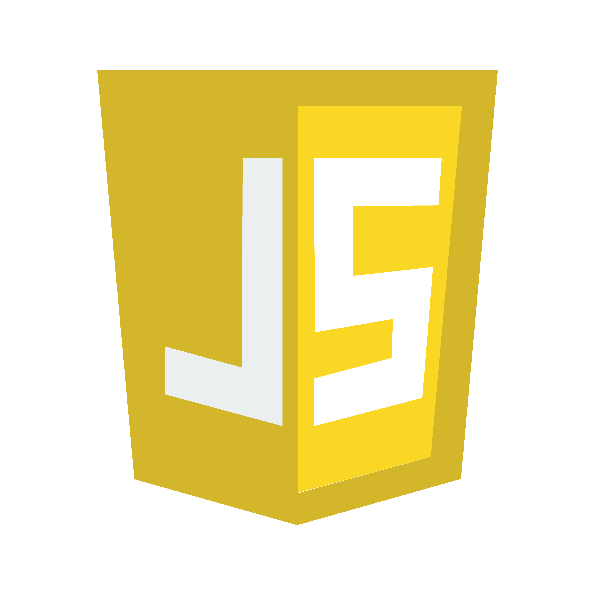
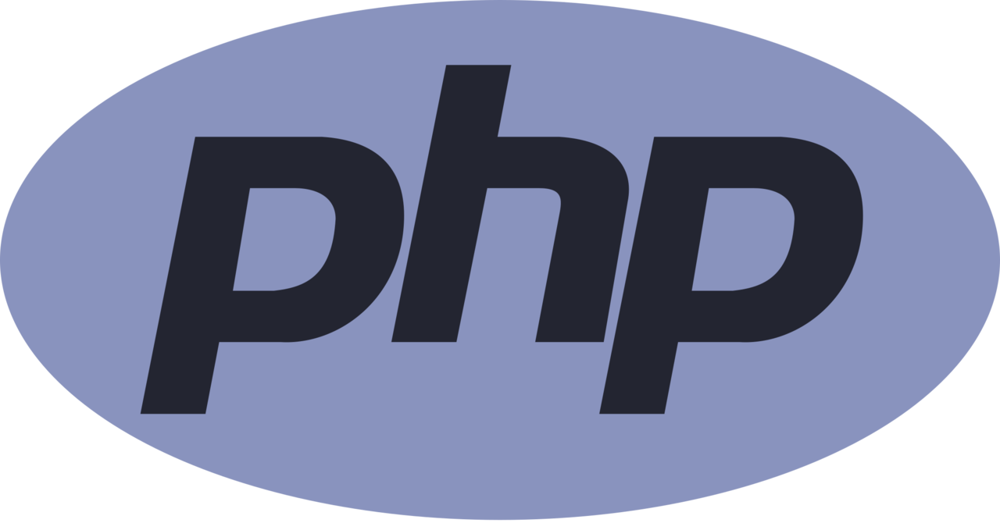
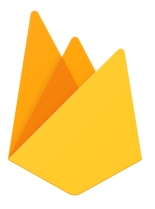
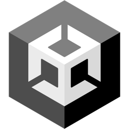

 <table>
  <tr>
    <td style="vertical-align: top;" width="70%">
      <h1> 👋 Hi there, I am Sarra Ayayda  </h1>
      Welcome to my GitHub profile! I'm a passionate Software Developer with a love for software development and Business Intelligence. My journey in tech has been fueled by curiosity and a drive to build, learn, and share.
      <h2> 🚀 About me </h2>
     <h4 color="violet"> Programming Languages and Technologies : </h4>
              
    </td>
    <td style="padding-left: 10px;" width="35%" >
      
    </td>
  </tr>
</table>

<!--
**Penorkaa/Penorkaa** is a ✨ _special_ ✨ repository because its `README.md` (this file) appears on your GitHub profile.

Here are some ideas to get you started:

- 🔭 I’m currently working on ...
- 🌱 I’m currently learning ...
- 👯 I’m looking to collaborate on ...
- 🤔 I’m looking for help with ...
- 💬 Ask me about ...
- 📫 How to reach me: ...
- 😄 Pronouns: ...
- ⚡ Fun fact: ...
-->
